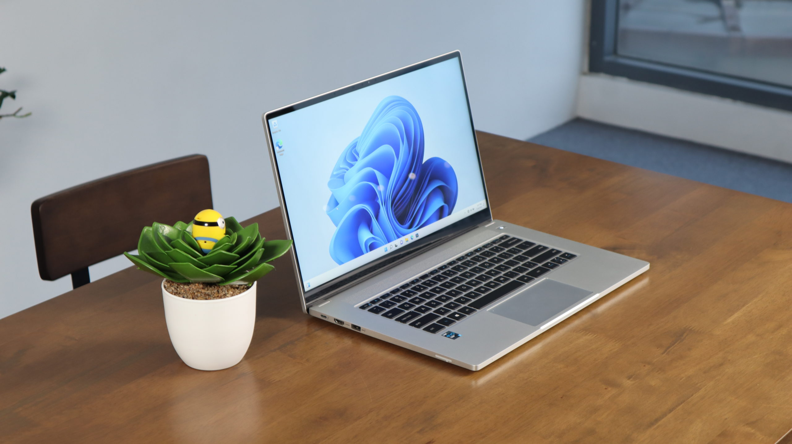

I'm Matthew (Water261), an open source developer based in Brisbane, Australia. 
I mainly write my code in [Rust](https://rust-lang.org) and use [Svelte](https://svelte.dev) for web development.
In my free time I like to learn about lots of different programming and computer science topics, as of writing this my current topics are:

- Cyber Security
- Identity & Access Management

I also enjoy contributing to the [kanidm](https://kanidm.com) project when I have spare time.

## Current Set Up
To write and contribute, I currently use [openSUSE Tumbleweed](https://opensuse.org) in WSL on my laptop. 
My laptop is an [Intel NUC M15 (EVO LAPRC710)](https://ark.intel.com/content/www/us/en/ark/products/225967/intel-nuc-m15-laptop-kit-evo-laprc710.html) running Windows 11 Pro and my code editor is [Visual Studio Code](https://code.visualstudio.com).

## My Socials
I'm always happy to help, below are some contact methods:

- Email: [hello@water261.au](mailto:hello@water261.au)
- Mastodon: https://mastodon.social/@water261
- Matrix: @water261:matrix.org
- Discord: water261

I normally hang out in the kanidm gitter room (#kanidm_community:gitter.im) and the openSUSE matrix space (#space:opensuse.org) on Matrix.
You can also find me in the [openSUSE Discord](https://discord.gg/opensuse), where I am the most active out of all platforms.

> Photo by [Pawel Czerwinski](https://unsplash.com/@pawel_czerwinski) on [Unsplash](https://unsplash.com/)
